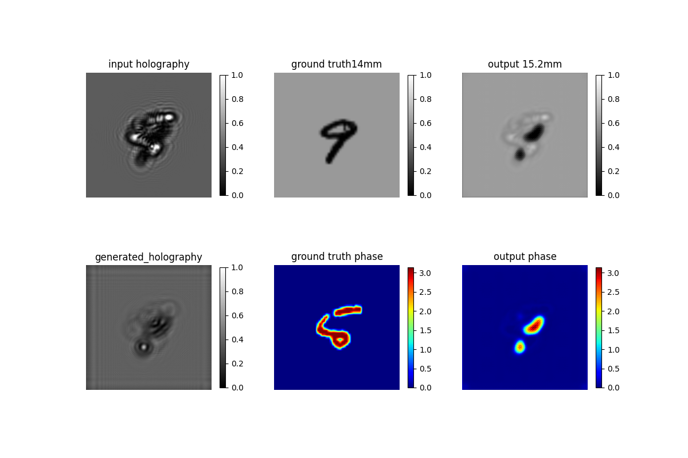

# Physics-informed unsupervised deep learning for adaptive holographic imaging

We provied pytorch(python) and matlab implementations of **Physics-informed unsupervised deep learning for adaptive holographic imaging**. This code was written by **Chanseok Lee**.

# Overview
Holographic image reconstruction ~

# System Requirements
## Clone
```
git clone https://github.com/csleemooo/Physics_informed_unsupervised_deep_learning_for_adaptive_holographic_imaging
```

## Packages
The following libraries are necessary for running the codes.
- Python >= 3.7
- Pytorch >= 1.10.2
- numpy
- PIL
- matplotlib

Please install requirements using below command.
```
pip install -r requirements.txt
```

## Environements
The package development version is tested on windows. The developmental version of the package has been tested on the following systems and drivers.
- Windows 10
- CUDA 11.3
- cuDnn 8.2

# Demo
## Training
Train model with **MNIST** dataset.  
### Parameter description  
- num_depth: 1 or 5 (1 for single depth measurement, 5 for multiple depth measurements)  
- mode: phase, amplitude, complex_amplitude  
- result_root: The root where trained parameters and intermediate training results are saved.  
- others: Other parameters (e.g. regularization constant, batch mode, batch size, iterations, and etc) can be modified. See ./model/Initialization.py.
```
python train.py --data_name mnist --num_depth 5 --data_root DATA_PATH --result_root RESULT_PATH --mode complex_amplitude
```

### Example of training result
Intermediate training results are saved in './args.result_root/mnist_MODE_NUM_DEPTH/'. Example images are as follows. 
|  | 
|:--:| 
| *Iteration 100* |
  
## Testing
Test model with **MNIST**, **Polystyrene microsphere**, **Tissue**, and **Red blood cell** dataset.  
Trained parameters can be downloaded from https://drive.google.com/drive/folders/1Y6R8plKylzHNT4wkBEA4GeOreY9id1xm?usp=sharing.  

### Test with MNIST
data_name: mnist
```
python test.py --data_name mnist --num_depth 5 --result_root RESULT_PATH --mode complex_amplitude
```

### Test with experimental dataset
data_name: polystyrene_bead (num_depth: 1 or 6), tissue_array, or red_blood_cell
```
python test.py --data_name polystyrene_bead --num_depth 6 --result_root RESULT_PATH
python test.py --data_name tissue_array --result_root RESULT_PATH
```
